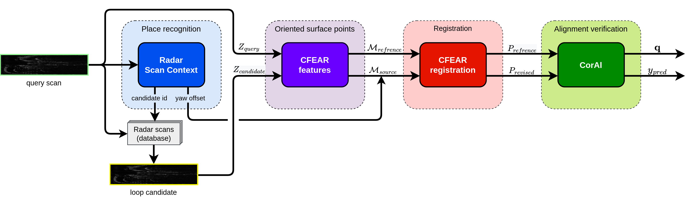

# Robust Radar Place Recognition and Verification

A two step system which first uses place recogniton based upon a radar based [Scan Context](https://gisbi-kim.github.io/publications/gkim-2018-iros.pdf) introduced in MulRan [dataset paper](https://irap.kaist.ac.kr/publications/gskim-2020-icra.pdf) and then the scan alignment verification [CorAl](https://arxiv.org/pdf/2205.05975.pdf). Additional tools for the system inlude [CFEAR](http://iliad-project.eu/wp-content/uploads/papers/cfear.pdf) used for radar scan filtration and reigstration. 

The proposed system consists of four modules:
- Place recognition (Radar Scan Context)
- Oriented surface points (CFEAR features)
- Registration (CFEAR registration)
- Alignment verification (CorAl)

## Radar Scan Context
Radar Scan Context is used to detect possible loop candidates using a radar data. The scan-index of the most likley loop candidate for the query is sent to a database with all previous radar images. From the database is the radar image candidate selected and forwarded to the next module. 

A predicted yaw difference between the query and loop candidate is also forwarded to later modules. 

## CFEAR
The query and loop candidate radar images are conerted to a set of **oriented surface poitns** using parts of the CFEAR method. With the two sets of surface poitns is a registration performed. Here is the yaw difference from the first module used as a initial transformation guess. 

A transformation is retrieved from the registrtion which is used in the last module. 

## CorAl
In the final module are first the two radar scans transformed into two 2D point clouds, using a filtration techniques from the CFEAR method. The retrieved transformation is applied to point cloud of query scan, making it aligned with the loop candidate.

The CorAl method is lastly used to classify if the point clouds are well aligned. If they are, the Radar Scan Context candidate most likley was a correct loop. However, if the point clouds are misaligned, the loop candidate could be a false positive. Thus, is the false positive rejected making for a more robust system. 