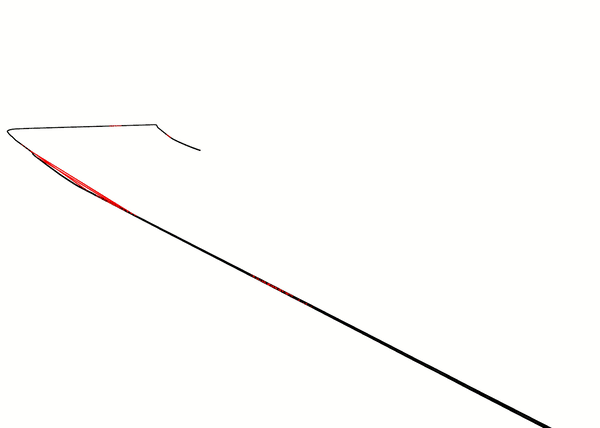
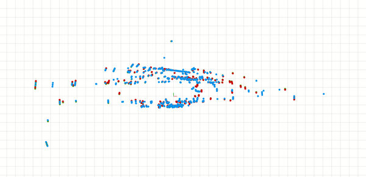
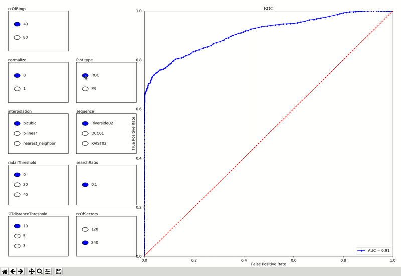
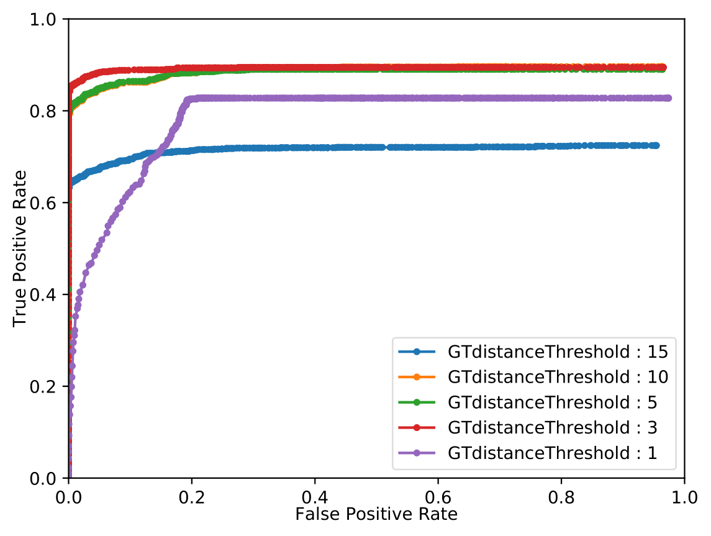

# How to run Scan Context evaluation
- Start ros node **_eval_sc_** using rosrun
- Example arguments to be given are: (See [/parameter/README.md](../parameters/README.md) for all possible arguments)
    - _**--dataset**_ : Name of dataset. 
    - _**--sequence**_ : Name of sequence.
    - _**--visualize**_ : True/False if to publish path and loop markers.
    - _**--sc_threshold**_ : SC threshold for visual loop markers (default: 0.16).
    - _**--loop_pause**_ : True/False if to pause at every loop found.
    - _**--experiment_name**_ : Name of the directory results are saved in. (saves as _unnamed_experiment_ if no name is given)

- Example command:
    ```
    rosrun place_recognition_radar eval_sc --dataset mulran --sequence Riverside01 --visualize true --experiment_name riverside_sc_test
    ```

- **Visualize:**
    - Use [/rviz/loop_markers.rviz](../rviz/loop_markers.rviz) to visualize results as below.
    - Dark line is previous driven path. Height increases with time.
    - Green markers: true loop with a correctly detected candidate. (true positives)
    - Red markers: no true loop with a detected candidate. (false positives)
    - Blue markers: true loop but no detected candidate. (false negatives)
    - Pink markers: true loop but wrongly chosen candidate.

    <p align="center"></p>

# How to run Coral evaluation
- Start ros node **_eval_coral_** using rosrun
- Start python script _**alignment_service.py**_, located in the _CorAl-ScanAlignmentClassification package_.
    - Give coral training data file as argument, see [How to generate CorAl training data](#how-to-generate-coral-training-data)
- Example command:
    ```
    rosrun place_recognition_radar eval_coral --dataset mulran --sequence Riverside01 --experiment_name riverside_coral_test
    ```

# How to run Scan Context + Coral evaluation
- Start ros node **_eval_sc_coral_** using rosrun
- Start python script _**alignment_service.py**_, located in the _CorAl-ScanAlignmentClassification package_.
    - Give coral training data file as argument, see [How to generate CorAl training data](#how-to-generate-coral-training-data)
- Example command:
    ```
    rosrun place_recognition_radar eval_sc_coral --dataset mulran --sequence Riverside01 --experiment_name riverside_sc_coral_test
    ```

    - **Visualize:**
    - Use [/rviz/sc_coral_viz.rviz](../rviz/sc_coral_viz.rviz) to visualize results as below.
    - Blue is reference (loop candidate)
    - Red is source (current guess with yaw offset)
    - Green is source revised (current with registration)

    <p align="center"></p>

# How to generate CorAl training data
- Start ros node **_coral_training_** using rosrun
- Use arguemnts to determine the sequence for training data
- Example command:
    ```
    rosrun place_recognition_radar coral_training --dataset mulran --sequence Riverside01
    ```

- Training data file is saved in _../place_recogntion_eval/trainingdata/sequence_training_data_
    - Use this file as input arguemnt for _**alignment_service.py**_

# How to start evaluation Python script
This is used for starting mutliple parallel evaluation based upon a parameter file.

- Run Python script _eval.py_ to start a new evaluation experiment. 
- Arguments to be given are:
    - _**--parameter_file**_ : name of desired parameter file located in [/parameters/](../parameters/)
    - _**--workers**_ : the number of paralell workers (default 8)

    Example command:
    ```
    python eval.py --parameter_file oxford_pars.txt --workers 8
    ```

- Results are written to directory _/{BAG_LOCATION}/place_recognition_eval/expirement_name_date/_
    - All csv files are merged into a combined file named _merged.csv_

# Important for evaluations
- Steps before running any evaluation node:
    - ROSCORE must be running.
    - Enviroment variable BAG_LOCATION needs to be set (e.g. in ~/.bashrc ) and should be assigned the path to where all data is stored.
    - Valid arguments must be given.
    - Correct directory structure for radar data and ground truth must be given.

# How to plot evaluation results using Python script
- Run Python script _plot.py_ to start open plot viewer. 
- Arguments to be given are:
    - _**--experiment_name**_ : name of the experiment results to be plotted.
    - _**--csv_file**_ : the name of the specific csv file to be plotted. (default merge.csv)   

    Example command:
    ```
    python plot.py --experiment_name riverside_coral_test
    ``` 
    
- **Important:**
    - The correct name for the experiment must be given. 
    - Enviroment variable BAG_LOCATION needs to be set (e.g. in ~/.bashrc ) and should be assigned the path to where all data is stored.
    - The experiment directory must be located in the correct place and contain the merged csv.file.
    - Two clicks are required in order to change parameters in the plot. (Is intended to change in the future)

    <p align="center"></p>


# How save plots using Python script
- Run Python script _plot_saver.py_ to save plots. 
- Arguments to be given are:
    - _**--experiment_name**_ : name of the experiment results to be saved.
    - _**--parameter**_ : Specific parameter to be compared.
        - GTdistanceThreshold, interpolation, nrOfRings, nrOfSectors, searchRatio, sequence, candidates

    Example command:
    ```
    python plot_saver.py --experiment_name riverside_sc_test --parameter GTdistanceThreshold
    ``` 

     <p align="center"></p>